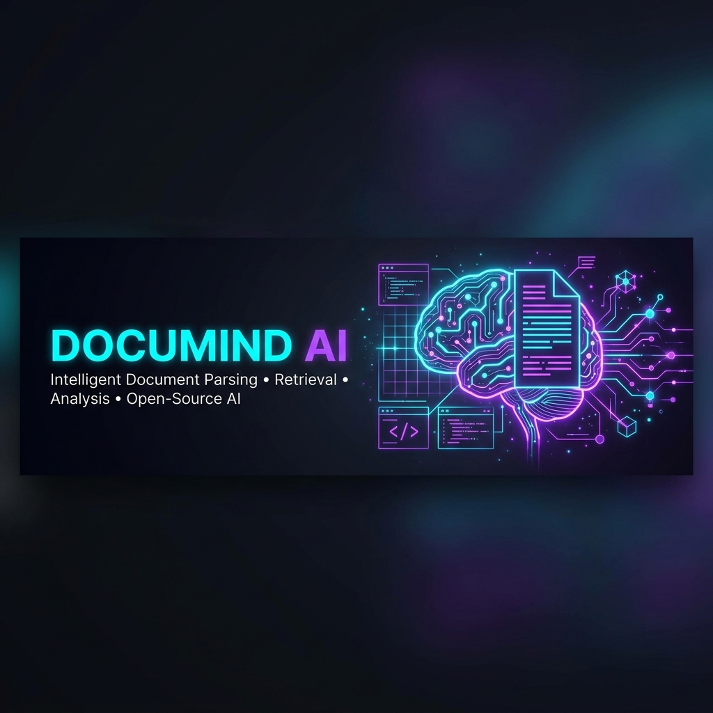
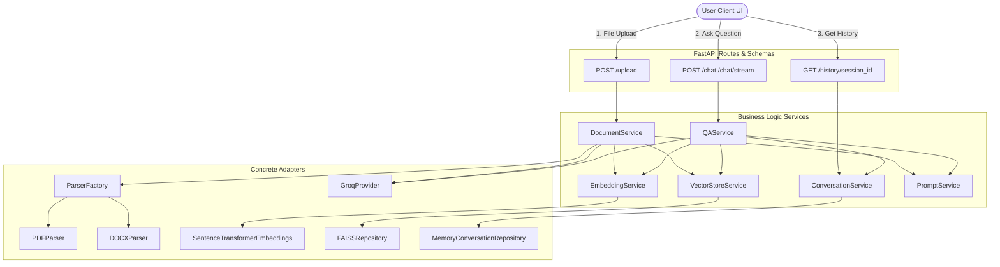

<p align="center">
  
</p>

<h1 align="center">DocuMind AI — Premium PDF/DOCX Question Answering RAG Assistant</h1>

<p align="center">
  <a href="https://github.com/MahmoudSalama7/DocuMind-AI"></a>
  
  
  
  
  
</p>

<p align="center">
  <strong>DocuMind AI</strong> is a production-ready, high-performance RAG (Retrieval-Augmented Generation) assistant designed for parsing and querying complex documents. Upload legal contracts, financial agreements, or policies, and interact with them in real-time.
</p>

---

## 🚀 Key Features

* **Advanced Document Parsing**: Native extraction of PDF (via `PyMuPDF`) and DOCX (via `python-docx`) files.
* **Deterministic RAG Pipeline**: Combines text extraction, overlapping chunking, Sentence Transformer embeddings, and FAISS vector database search.
* **Hallucination Prevention**: Features a precision gating threshold; if no content exceeds the similarity threshold, the LLM safely defers instead of generating false information.
* **SSE Token Streaming**: Real-time token-by-token response streaming inside an interactive UI.
* **Smart Memory Persistence**: Full session memory retention for accurate context-aware follow-up queries.
* **Suggested Follow-Ups**: Automatically generates 3 relevant follow-up questions using context-aware prompts.
* **Clean Architecture & SOLID Design**: Built following clean-code principles, decoupled layers, and industry-standard design patterns.

---

## 💻 Tech Stack

* **Backend**: FastAPI, Pydantic, Python 3.12
* **NLP & Embeddings**: Sentence Transformers (`all-MiniLM-L6-v2`)
* **Vector Database**: FAISS (Facebook AI Similarity Search)
* **LLM Engine**: Groq Cloud API (Llama 3 8B / 70B)
* **Frontend**: Vanilla HTML5, Premium CSS3 (Glassmorphism design, dark mode, smooth micro-animations), and modern JavaScript.
* **Deployment**: Docker & Docker Compose

---

## 🏗️ System Architecture



---

## 📂 Folder Structure

```text
app/
├── api/                             # API Layer (Controllers, dependencies, schemas)
│   ├── routes/                      # Upload, Chat, and History controllers
│   ├── dependencies.py              # FastAPI Depends() providers
│   └── schemas.py                   # Pydantic validation models
├── domain/                          # Domain Layer (Pure Python Entities & Interfaces)
│   ├── models.py                    # Domain entities (Document, Chunk, etc.)
│   └── interfaces/                  # Abstract interfaces (ABCs)
├── services/                        # Service Layer (Business Logic Orchestration)
├── infrastructure/                  # Infrastructure Layer (Concrete Adapters)
│   ├── parsers/                     # PDF and DOCX parsers
│   ├── llm/                         # Groq LLM provider
│   ├── embeddings/                  # Sentence Transformer embeddings
│   ├── vectorstore/                 # FAISS vector store repository
│   └── storage/                     # Session history repository
└── utils/                           # Shared utility helpers (JSON logger)

frontend/                            # Web UI
├── index.html                       # HTML5 Structure
├── styles.css                       # Premium CSS Styles
└── app.js                           # JavaScript Client Logic

tests/                               # Test suite
```

---

## 💎 Design Patterns & Best Practices

| Pattern | Component | Rationale |
|---|---|---|
| **Factory Pattern** | `ParserFactory` | Auto-detects and loads PDF or DOCX parser based on the uploaded file's extension. |
| **Strategy Pattern** | `LLMProvider` | Decouples the LLM generation logic from specific vendors (e.g. Groq, OpenAI), making backend swaps seamless. |
| **Repository Pattern** | `VectorRepository` | Abstracts the vector database operations (FAISS), enabling future migration to Chroma or Pinecone without touching core logic. |
| **Dependency Injection** | `dependencies.py` | FastAPI's built-in `Depends()` system dynamically injects singletons and services into endpoints, facilitating clean unit testing. |
| **Singleton Pattern** | `get_settings` | `@lru_cache` loads settings from `.env` once and provides a single, configuration instance throughout the application. |

---

## 🛠️ Installation & Setup

### Local Setup (Python 3.12)

1. **Clone the repository**:
   ```bash
   git clone https://github.com/MahmoudSalama7/DocuMind-AI.git
   cd DocuMind-AI
   ```

2. **Initialize and activate a virtual environment**:
   ```bash
   python -m venv venv
   # On Windows:
   venv\Scripts\activate
   # On Unix or MacOS:
   source venv/bin/activate
   ```

3. **Install dependencies**:
   ```bash
   pip install -r requirements.txt
   ```

4. **Configure environment variables**:
   Create a `.env` file in the root directory:
   ```bash
   cp .env.example .env
   ```
   Add your `GROQ_API_KEY` (e.g., `gsk_...`) in the `.env` file.

5. **Run the development server**:
   ```bash
   uvicorn app.main:app --reload --port 8000
   ```

6. Open your browser at `http://localhost:8000` to access the application.

---

### Running with Docker

1. Ensure Docker and Docker Compose are installed.
2. Confirm you have created the `.env` file with a valid `GROQ_API_KEY`.
3. Start the application stack:
   ```bash
   docker compose up --build
   ```
4. The service will be available immediately at `http://localhost:8000`.

---

## 🔌 API Documentation

### 1. Document Upload
* **Endpoint**: `POST /upload`
* **Request**: Multipart file form-data (`file`).
* **Response**:
  ```json
  {
    "document_id": "9bc3f572-c513-4318-ae2d-d558b0907e59",
    "filename": "lease_agreement.pdf",
    "pages": 4,
    "chunks": 12,
    "summary": "This document outlines the commercial lease agreement between landlord X and tenant Y, detailing term timelines, rental rates, and maintenance liabilities."
  }
  ```

### 2. Chat (Synchronous)
* **Endpoint**: `POST /chat`
* **Request Body**:
  ```json
  {
    "document_id": "9bc3f572-c513-4318-ae2d-d558b0907e59",
    "question": "What is the lease termination notice duration?",
    "session_id": "optional-session-id"
  }
  ```
* **Response**:
  ```json
  {
    "answer": "According to page 3, either party may terminate the lease agreement by providing at least 60 days written notice.",
    "sources": [
      {
        "page": 3,
        "chunk": 8,
        "score": 0.8872,
        "preview": "...either party may terminate this Lease Agreement by giving at least sixty (60) days advance written notice..."
      }
    ],
    "suggested_questions": [
      "What is the maximum fine for serious GDPR violations?",
      "Does GDPR apply to companies outside the EU?",
      "What is the “right to be forgotten”?"
    ],
    "session_id": "optional-session-id"
  }
  ```

### 3. Chat (Streaming via SSE)
* **Endpoint**: `POST /chat/stream`
* **Request Body**: Same as Chat (Synchronous)
* **Event stream types**:
  * `sources`: Emitted first containing reference metadata list.
  * `token`: Streamed text token chunks.
  * `follow_ups`: Emitted containing the array of generated follow-up questions.
  * `done`: Emitted at stream completion.

### 4. Conversation History
* **Endpoint**: `GET /history/{session_id}`
* **Response**:
  ```json
  {
    "session_id": "session-123",
    "document_id": "9bc3f572-c513-4318-ae2d-d558b0907e59",
    "messages": [
      {
        "role": "human",
        "content": "What is the termination clause?",
        "timestamp": "2026-06-27T17:00:00Z"
      },
      {
        "role": "assistant",
        "content": "According to page 3, either party may terminate by providing at least 60 days written notice.",
        "timestamp": "2026-06-27T17:00:05Z"
      }
    ]
  }
  ```

---

## 🧪 Testing & Quality Assurance

Run unit and integration tests using `pytest` to guarantee system stability:
```bash
pytest tests/ -v
```

To run tests with coverage reporting:
```bash
pytest tests/ --cov=app --cov-report=term-missing
```

---

## 🔮 Future Roadmap

1. **Hybrid Retrieval**: Combine FAISS vector retrieval with BM25 lexical keyword matching to handle technical jargon and acronyms.
2. **Persistent DB storage**: Store document schemas, chunk mappings, and chat session histories in PostgreSQL (with `pgvector`) rather than in-memory storage.
3. **Multi-Document Chat Sessions**: Enable users to build workspaces comprising multiple files and query across all of them in a single chat room.

---

## 📄 License

Distributed under the MIT License. See `LICENSE` for more details.
